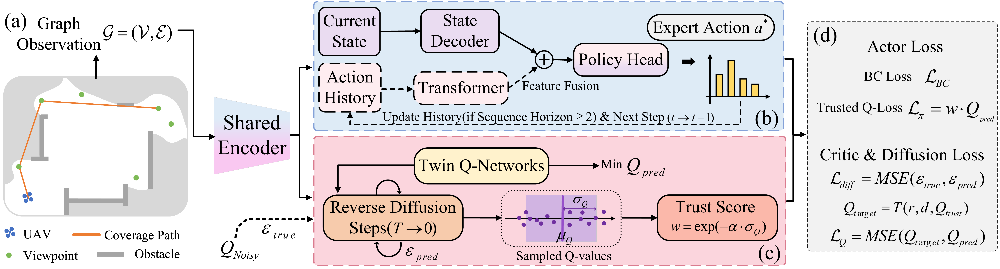

# DST-Planner

**DST-Planner: Diffusion-Augmented Sequential Topological Planning for Robotic Exploration in Complex Environments**

This repository will host the official implementation of **DST-Planner**.
The code, training scripts, configuration files, and deployment instructions are currently being organized and will be released here.

## Pipeline



## Release Status

- [x] Project page initialized
- [x] Method pipeline released
- [ ] Source code cleanup
- [ ] Training and evaluation scripts
- [ ] Configuration files and model checkpoints
- [ ] Documentation for reproduction

## Citation

If you find this work useful, please consider citing:

```bibtex
@article{yuan2026dstplanner,
  title   = {DST-Planner: Diffusion-Augmented Sequential Topological Planning for Robotic Exploration in Complex Environments},
  author  = {Yuan, Yiqing and Li, Zhi and Liang, Jiahui and Duan, Peiming and Zhang, Xiaoxun and Guo, Jihe and Cheng, Hui},
  journal = {IEEE Robotics and Automation Letters},
  year    = {2026}
}
```
